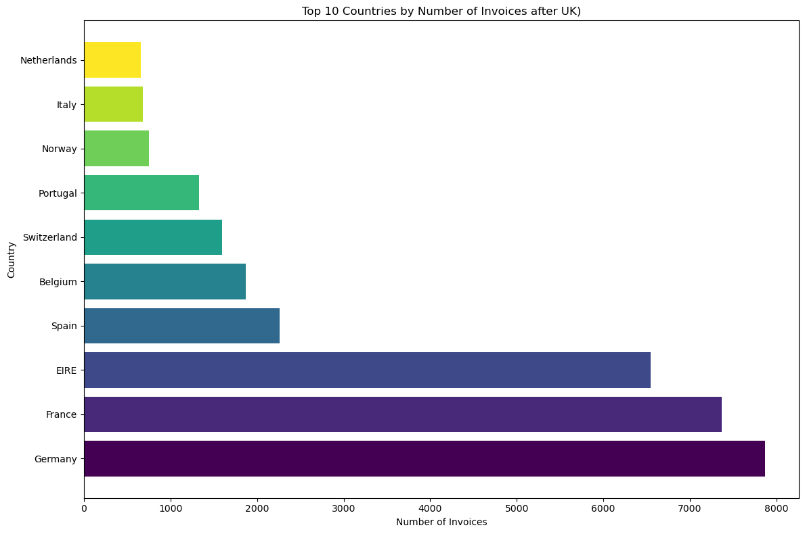
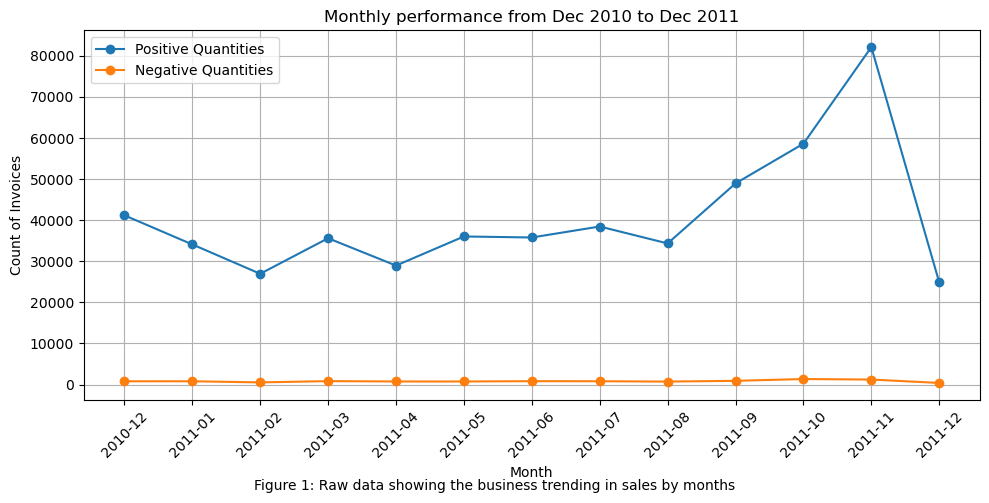
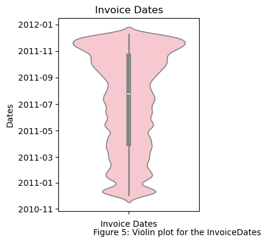

# 🛍️ Exploratory Data Analysis on Online Retail 

[UK_retail_exploratory_data_analysis](notebooks/UK_retail_exploratory_data_analysis.ipynb)  

  

## 📖 Project Overview  
This project explores a large-scale **online retail dataset** with over **541,000 transactions**, containing details of products, quantities, prices, countries, and timestamps.  

The analysis aims to uncover **business performance trends, market opportunities, and customer behaviours** through Python-based **exploratory data analysis (EDA)**.  

The ultimate goal is to generate **data-driven recommendations** that support strategic planning, boost customer satisfaction, and enhance competitiveness in the global retail market.  

---

## 🎯 Project Goals  
- Utilise EDA to uncover insights on retail performance, customer patterns, and emerging markets.  
- Support **strategic planning** by identifying regions with growth potential and seasonal shopping trends.  
- Provide **data-driven recommendations** to improve sales, expand market share, and build customer loyalty.  

---

## 🔎 Project Scenario  
An **online retailer** seeks to understand its business performance and customer behaviour. By analysing its transaction data, the retailer aims to:  
- Identify **core markets** and **emerging opportunities**.  
- Optimise stock and operations through insights into **seasonal shopping habits**.  
- Strengthen **competitiveness** in a fast-paced global retail industry.  

---

## 📊 Key Findings  
- **UK remains the primary market**, but **Germany, France, and Ireland** (~8,000 invoices/year each) represent promising expansion opportunities.  
- Customers exhibit **seasonal purchasing behaviours**: activity rises from March and **peaks sharply in November**.  
- Stocking **seasonal bestsellers** before peak months can significantly increase sales.  
- Customer demand patterns highlight the importance of **timely product promotions and targeted campaigns**.  

---

## 🛠️ Approach & Methodology  
1. **Data Import & Cleaning**  
   - Removed duplicates and handled missing values.  
   - Ensured consistent formatting of dates, prices, and quantities.  

2. **Preprocessing & Wrangling**  
   - Structured transactional data for exploratory analysis.  
   - Created summary tables (e.g., seasonal sales, country breakdown).  

3. **Exploratory Data Analysis (EDA)**  
   - Descriptive statistics for customer and sales distribution.  
   - Visualisations for markets, seasonal demand, and shopping habits.  

4. **Business Insights & Recommendations**  
   - Identified high-value customers and markets.  
   - Provided strategic advice for product stocking and market expansion.  

---

## 📈 Figures  

### Top 10 Countries by Number of Invoices (after UK)  
  

### Seasonal Sales Trends  
  

### Customer Shopping Behaviour  
  

---

## 📂 Repository Structure  
```plaintext
Exploratory_Data_Analysis_on_retailing/
│── data/                   # Raw and processed datasets  
│   ├── raw/                # Original dataset  
│   └── processed/          # Cleaned datasets  
│
│── notebooks/              # Jupyter notebooks with step-by-step analysis  
│   ├── UK_retail_exploratory_data_analysis.ipynb  
│
│
│── results/                # Outputs, charts, and summary tables  
│   ├── figures/            # Visualisations (png, jpg)  
│   └── ac
hievements/       # Key outcomes and highlights  
│
│── requirements.txt        # Python dependencies  
│── README.md               # Project documentation (this file)  
🛠️ Tools & Technologies
Python: pandas, matplotlib, seaborn
Jupyter Notebook: analysis workflow and visualisation
GitHub: version control and collaboration
✅ Takeaways
Data analytics can highlight both current strengths and untapped opportunities in retail.
Seasonal insights enable better inventory planning, reducing missed sales.
Market expansion should target Germany, France, and Ireland as immediate growth areas.
Strategic use of analytics can drive sustainable growth and customer satisfaction.
👤 Author: Long Hoa Chung
📜 Part of the IBM Coursera Data Science Certification Projects
